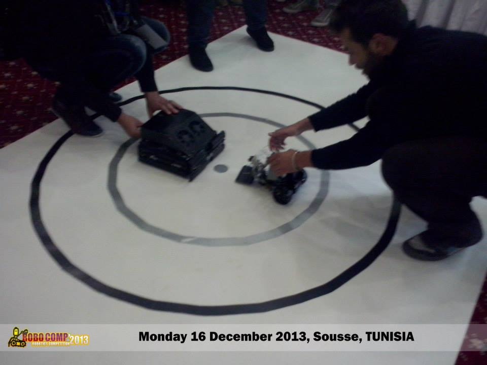
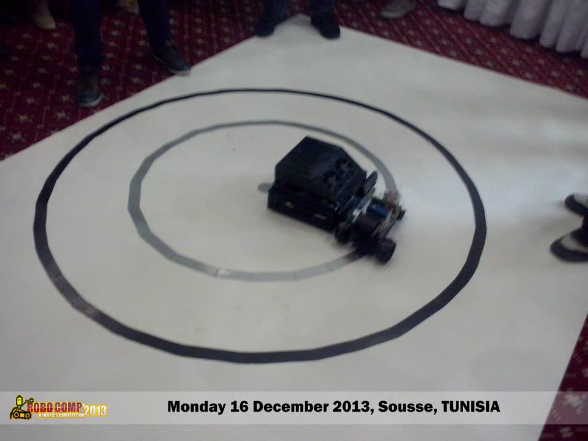
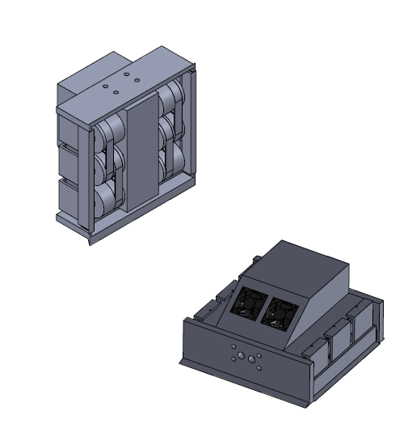
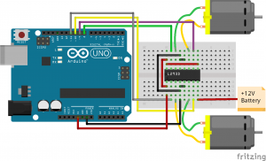
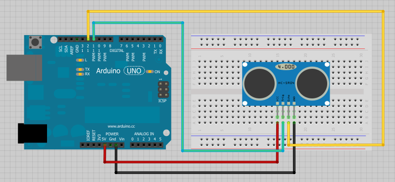
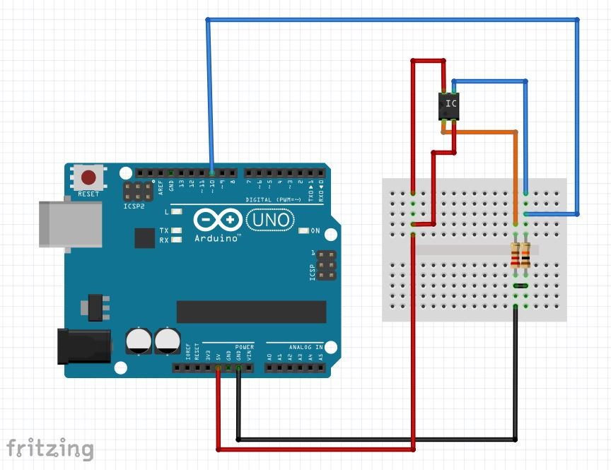
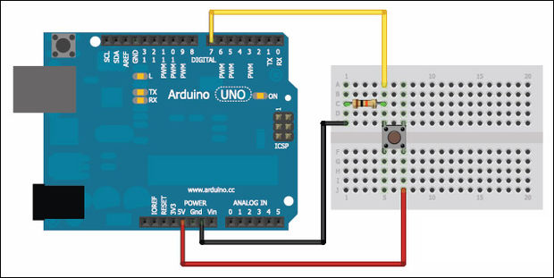

# Sumo Fighter Robot
An Arduino based autonomous Sumo Fighter Robot.

 

# Mechanical Design:
Solidworks drawing are available under: 
https://github.com/TrifiAmanallah/Sumo-Fighter-Robot/tree/master/Mechanics

# Eletrical Components:
The Robot is composed of:
 - An arduin Uno board.
 - Two infra Red sensors, one on the front and one the back.
   Both are pointed down to detect when the robot reaches the perimeters of the ring.
   Reference: Cny70
   Datasheet: Sumo-Fighter-Robot\Datasheets\Cny70.pdf
 - One Ultrasound sensor to detect the oppenent robot.
   Sensor is put on the front of the robot pointed at 90 degrees from ground.
   Reference: Parallax-28015
   Datasheet: Sumo-Fighter-Robot\Datasheets\Parallax-28015.pdf
 - One H-bridge motor driver
   Reference: L293D
   Datasheet: Sumo-Fighter-Robot\Datasheets\L293D.pdf 
 - Two DC Motors
   Reference: Valeo Baureihe 0278
   Datasheet: Sumo-Fighter-Robot\Datasheets\Motor_3.pdf
-  Four push buttons, to detect if the robot is being pushed from either sides.
   Two buttons on each sides of the robot. 
-  One Lipo Battery
   Reference: Turnigy 2200mAh
   Datasheet: Sumo-Fighter-Robot\Datasheets\Lipo_batteries.pdf
   
   # Wiring Components:
   
   The Motors:
   
   
   
   The Ultrasound sensor:
   
   
 
   The IR sensor:
   
   
 
   The push buttons:
   
   
 
   
